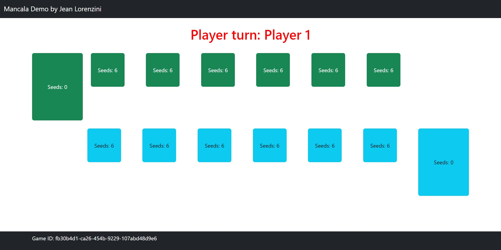

# Jean Caserta Lorenzini
## Name
Demo Mancala project for Spring Boot by Jean Lorenzini.

## Description
This project will be used as API service for a Mancala game done as part of technical assessment for [bol.com](https://www.bol.com/).

## Visuals

## Installation
* JDK 11
* Maven
* Lombok

## Usage
Project Service can be executed as java application or using Maven mvn spring-boot:run.

After running back-end service open [main.html](./main.html) page to start playing. 

Note: If running on a newly set Windows 11 machine below VM argument maybe required:

-Djava.net.preferIPv4Stack=true

## Documentation
API Swagger UI URL:

* [http://localhost:8080/mancala/swagger-ui/index.html](http://localhost:8080/mancala/swagger-ui/index.html)

## Support
jean.clorenzini@gmail.com

## Roadmap
* Enhancement for UI 
* Cross-platform multiplayer

## Contributing
Not accepting external contribution at the moment as it's an assessment.

## Authors and acknowledgment
Author - Jean Lorenzini

## License
GNU General Public License

## Project status
Project on-going

### Reference Documentation
For further reference, please consider the following sections:

* [Official Apache Maven documentation](https://maven.apache.org/guides/index.html)
* [Spring Boot Maven Plugin Reference Guide](https://docs.spring.io/spring-boot/docs/2.6.7/maven-plugin/reference/html/)
* [Create an OCI image](https://docs.spring.io/spring-boot/docs/2.6.7/maven-plugin/reference/html/#build-image)
* [Spring Web](https://docs.spring.io/spring-boot/docs/2.6.7/reference/htmlsingle/#boot-features-developing-web-applications)
* [Spring Session](https://docs.spring.io/spring-session/reference/)

### Guides
The following guides illustrate how to use some features concretely:

* [Building a RESTful Web Service](https://spring.io/guides/gs/rest-service/)
* [Serving Web Content with Spring MVC](https://spring.io/guides/gs/serving-web-content/)
* [Building REST services with Spring](https://spring.io/guides/tutorials/bookmarks/)
